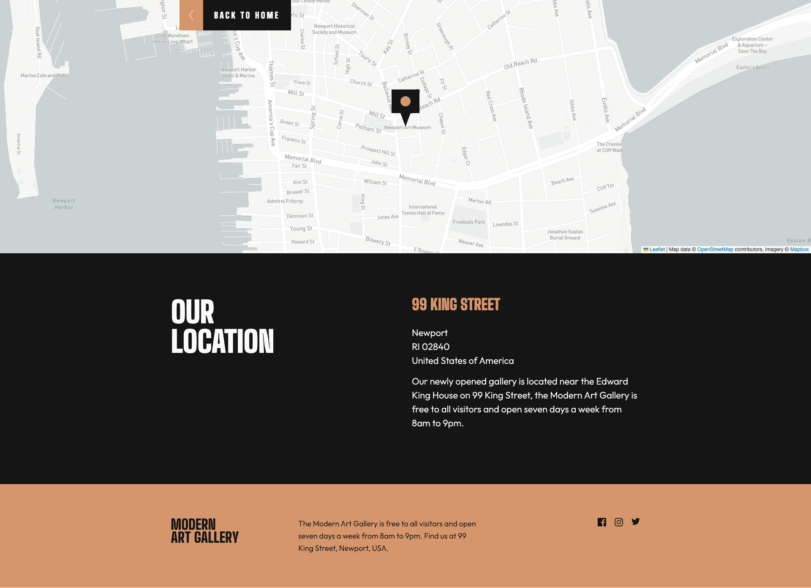

# Frontend Mentor - Art gallery website

This is my solution to the [Art gallery website challenge on Frontend Mentor](https://www.frontendmentor.io/challenges/art-gallery-website-yVdrZlxyA).

## Table of contents

- [Overview](#overview)
  - [The challenge](#the-challenge)
  - [Screenshot](#screenshot)
  - [Links](#links)
- [My process](#my-process)
  - [Built with](#built-with)
  - [What I learned](#what-i-learned)
  - [Useful resources](#useful-resources)
- [Author](#author)

## Overview

### The challenge

Users should be able to:

- View the optimal layout for each page depending on their device's screen size
- See hover states for all interactive elements throughout the site
-  **Bonus**: Use [Leaflet JS](https://leafletjs.com/) to create an interactive location map with custom location pin

### Screenshot

#### Home page


#### Location page



### Links

- Solution URL: [Art gallery website](https://www.frontendmentor.io/challenges/art-gallery-website-yVdrZlxyA)
- Live Site URL: [fm-modern-art-gallery.netlify.app](https://fm-modern-art-gallery.netlify.app/)

## My process

### Built with

- Semantic HTML5 markup
- Mobile-first approach
- Flexbox
- CSS Grid
- GSAP animation
- [TypeScript](https://www.typescriptlang.org/)
- [Sass](https://sass-lang.com/)
- [webpack](https://webpack.js.org/)

### What I learned
- While I have been using Sass CSS preprocessor for a long time, I primarily used it for its variables and nested rules features. As I spent more time reviewing other projects I noticed that I could gain efficiency in my CSS authoring by implementing Sass maps in conjunction with `At-rules` like `@each` etc. I started using these to generate helper classes in my project.
```scss
$colors: (
  dark: (
    color-1: rgba(68, 68, 68, 1),
    color-2: rgba(21, 21, 21, 1)
  )
);

@each $color, $shade  in  $colors {
  @each $key, $value  in  $shade {
    .text-#{""  + $color}-#{$key} {
      color: #{$value}  !important;
    }
  }
}

// CSS Output
.text-dark-color-1 {
  color: #444444 !important;
}

.text-dark-color-2 {
  color: #151515 !important;
}
```
- I started using custom CSS properties as this allows me to better organise my CSS. Variables that are specific to a component are located in the same module, the set of rules are less repetitive as I can leverage on the cascade.
```scss
.card {
  --h-spacing: #{toRem(24px)};
  --v-spacing: #{toRem(48px)};

  &__content {
    padding: var(--v-spacing) var(--h-spacing);
  }

  @include media-breakpoint(md) {
    --h-spacing: #{toRem(28px)};
    --v-spacing: #{toRem(69px)};
  }

  @include media-breakpoint(xl) {
    --h-spacing: #{toRem(48px)};
    --v-spacing: #{toRem(52px)};
  }
}
```
- Getting the grid as per the design was more challenging than I thought. I initially started with by defining the height of each row for the main content for different viewport widths but I soon realised that this was difficult to maintain. I finally found an efficient solution by using the `minmax()` function with the `grid-template-columns` and `grid-template-rows` properties.
```scss
.content-rows {
  grid-template-rows: repeat(auto-fit, minmax(toRem(200px), 1fr));
}
```
- I was able implement responsive images by using the `<picture>` and `<source>` elements in conjunction with the `` element. This allows me to serve images in portrait mode on smaller viewports.
```html
<div class="card">
  <div class="card__content">
    <picture>
      <source media="(max-width: 767px)" srcset="assets/images/home/mobile/image-grid-1.jpg">
      <source media="(max-width: 768px)" srcset="assets/images/home/tablet/image-grid-1.jpg">
      <source media="(max-width: 1200px)" srcset="assets/images/home/desktop/image-grid-1.jpg">
      
    </picture>
  </div>
</div>
```

### Useful resources

- [Responsive grid in 2 minutes with CSS grid layout](https://travishorn.com/responsive-grid-in-2-minutes-with-css-grid-layout-4842a41420fe)
- [Responsive grid magazine layout in just 20 line of CSS](https://css-tricks.com/responsive-grid-magazine-layout-in-just-20-lines-of-css/)

## Author

- Christopher Adolphe
- Frontend Mentor - [@christopher-adolphe](https://www.frontendmentor.io/profile/christopher-adolphe)
- Twitter - [@cadolphe23](https://twitter.com/cadolphe23)
